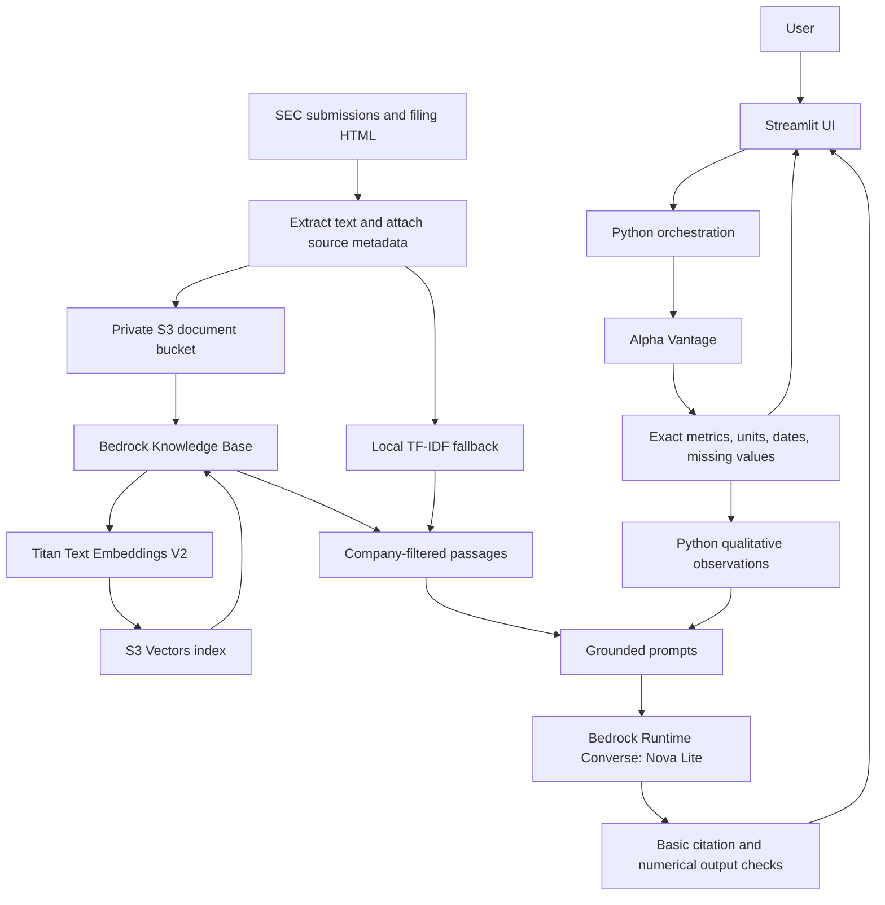
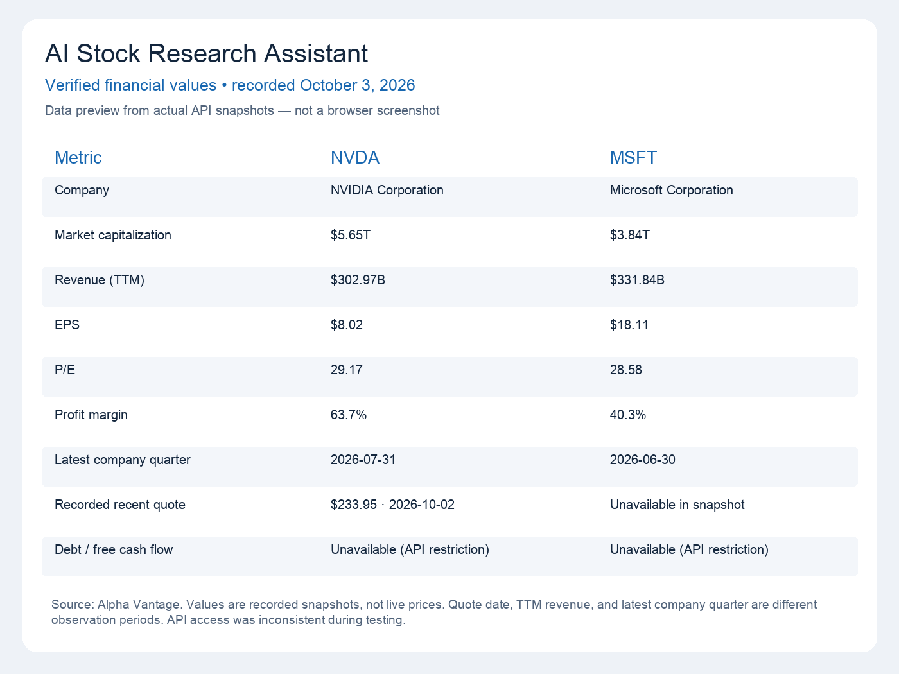
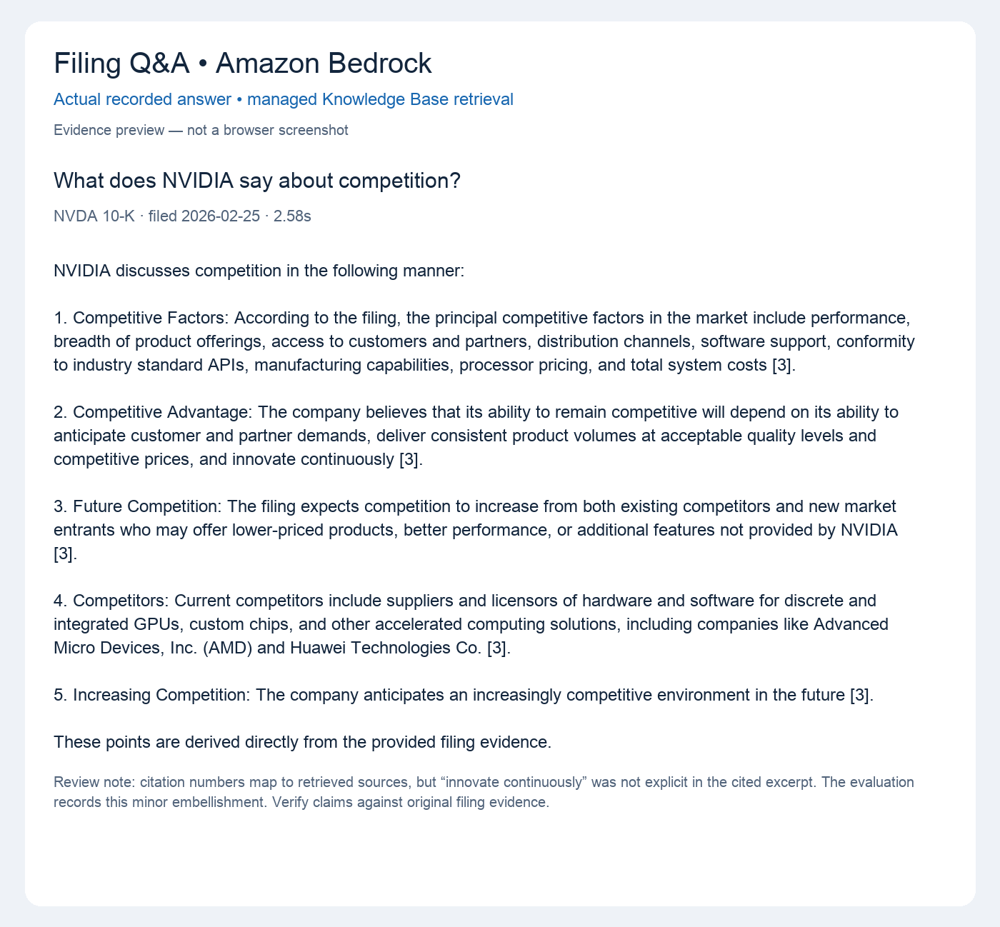

# AI Stock Research Assistant

A working educational research app built with **Amazon Bedrock, Python, Streamlit, S3, SEC filings, and Alpha Vantage**. It separates reproducible financial facts from AI explanation and lets users inspect the filing passages behind answers.

## Problem

Researching a company means combining market data with lengthy filings. A general chatbot can confuse reporting periods, invent numbers, or answer from stale training knowledge. This project provides a financial data pipeline and retrieves company-specific filing evidence before asking a model to explain it.

It does not predict stock prices, guarantee returns, or issue BUY/SELL recommendations.

## Implemented features

- Ticker validation and company profiles, recent quotes, and available financial metrics.
- Explicit unavailable values and provider errors rather than fabricated data.
- Financial table with quote dates, statement periods, and currency labels.
- Structured, qualitative AI reports: overview, developments, observations, growth factors, risks, and further questions.
- Filing Q&A for AAPL, MSFT, and NVDA, with numbered citations, source excerpts, filing dates, and original SEC links.
- Live Bedrock Knowledge Base retrieval using Titan embeddings and S3 Vectors, filtered by ticker metadata.
- Local TF-IDF vector retrieval fallback using overlapping chunks and cosine similarity.
- Financial comparison table and qualitative Bedrock comparison.
- A 24-question evaluation framework with real sampled outputs, latency, and candid review notes.
- Unit and Streamlit interaction tests, GitHub Actions configuration, and an interview guide.

## What was verified

On October 3, 2026:

- Python invoked **Amazon Nova Lite** through **Converse** in `us-east-1` using a temporary `stock-research` AWS login profile.
- Alpha Vantage returned NVIDIA's company overview and a quote dated October 2, 2026. Later NVDA and MSFT overview requests succeeded; quote and financial statement availability was inconsistent because the provider returned restrictions. Debt and free cash flow were not verified from live statements.
- Three public 10-Ks were downloaded, converted to text, and uploaded with metadata to a private S3 bucket. Six objects were verified.
- The Knowledge Base indexed three filing documents and three metadata documents with zero failed documents.
- Three actual Q&A requests per retrieval mode were captured in `evaluation/results_*.json`. These are sampled observations, not a complete benchmark.
- All 23 automated tests passed. Actual Streamlit controls generated a managed research report and a cited filing answer successfully. Both local and managed research report generation were tested. Model numerical mistakes discovered during smoke testing led to the final qualitative report boundary and output checks.
- The app ran locally, and automated Streamlit tests exercised its key controls. Browser screenshot capture failed in this environment; no screenshots are claimed.

## Architecture



The S3 document bucket holds text, not vectors. S3 Vectors uses a separate vector bucket/index. Local mode reads downloaded files; it does not require a Knowledge Base or call Titan. Both modes use Bedrock for answer generation. Managed mode failures are shown explicitly rather than silently switching backends.

## Technology and AWS services

Python, Streamlit, requests, pandas (provided by Streamlit), pytest, Boto3 with CRT console-login support, and python-dotenv. No LangChain framework is required.

AWS services used: Bedrock Runtime, Bedrock Knowledge Bases, S3, S3 Vectors, and IAM. Nova Lite is the generation model; Titan Text Embeddings V2 produces 1,024-dimensional learned embeddings for managed retrieval.

## Files

```text
ai-stock-research-assistant/
├── app.py                 # Streamlit interface
├── bedrock.py             # Converse and response parsing
├── financial_data.py      # Alpha Vantage normalization and caching
├── filings.py             # SEC download, text extraction, S3 upload
├── rag.py                 # Local vectors and Knowledge Base Retrieve
├── prompts.py             # Evidence-aware task prompts
├── research.py            # Research and Q&A orchestration
├── config.py              # Local environment settings
├── aws_setup.py           # Private S3 document bucket setup
├── kb_setup.py            # Resumable Knowledge Base setup/status
├── requirements.txt
├── .env.example
├── .gitignore
├── README.md
├── INTERVIEW_PREP.md
├── data/filings/           # Public extracted text and source metadata
├── evaluation/            # Questions, real outputs, review methodology
├── tests/
├── screenshots/           # Capture instructions; screenshots pending
├── architecture/          # Mermaid and scoped runtime policy example
└── .github/workflows/      # Offline unit/UI test workflow
```

`.venv`, `.env`, and `data/private` are local-only and excluded from Git. Local AWS resource identifiers and private smoke-test artifacts are under `data/private`.

## Installation

Use Python 3.11 or later. This project was tested locally with Python 3.14; CI is configured for Python 3.12 but has not been run on GitHub yet.

```sh
python3 -m venv .venv
source .venv/bin/activate
python -m pip install -r requirements.txt
```

On a fresh clone, copy `.env.example` to `.env`. **The existing local workspace is already configured; do not overwrite its `.env`.**

```sh
cp .env.example .env
python -m pytest -q
python -m streamlit run app.py
```

Open http://localhost:8501. The app server starts locally; this project does not include a public deployment or user authentication.

## AWS login and model setup

1. Install AWS CLI v2.32 or newer. Console-login users can run:

   ```sh
   aws login --profile stock-research --region us-east-1
   ```

   Complete the browser sign-in and approval yourself. Organization IAM Identity Center users can use `aws configure sso` and `aws sso login` instead.
2. Set the region, profile, and model in `.env`. The tested model is `amazon.nova-lite-v1:0` in `us-east-1`.
3. Verify the model in the Bedrock console playground and run `python bedrock.py`. Other accounts may require different model access, provider prerequisites, or an inference profile. Do not assume the model is available everywhere.
4. Console-login credentials are temporary and may require another `aws login` when the session expires. Boto3 uses its normal credential chain; CRT supports the login-session provider.

Model inference, embeddings, S3 storage/requests, and vector retrieval/storage incur AWS charges. No cost estimate is fabricated. Check current pricing and your AWS billing dashboard.

## Environment variables

| Variable | Purpose |
|---|---|
| `AWS_REGION` | AWS region; tested with `us-east-1` |
| `AWS_PROFILE` | Local profile; tested with `stock-research` |
| `BEDROCK_MODEL_ID` | Converse-compatible model or inference profile ID |
| `ALPHA_VANTAGE_API_KEY` | Financial API key, saved only in `.env` |
| `SEC_USER_AGENT` | Actual requester name and contact email for SEC requests |
| `S3_BUCKET` | Private filing document bucket, populated by setup |
| `BEDROCK_KNOWLEDGE_BASE_ID` | Managed retrieval ID, populated after successful ingestion |

Do not paste secrets into chat, commit `.env`, or store AWS keys in source. The project uses your local AWS profile, not embedded AWS credentials.

## Filings and S3 setup

`filings.py` queries the public SEC submissions endpoint, selects the most recently filed 10-K in recent history, extracts HTML text, and attaches ticker, filing/report dates, accession number, and source URL. It makes serial, throttled requests and validates the response length. The extraction is an MVP text parser; it does not preserve all table structure.

```sh
python filings.py --ticker AAPL
python filings.py --ticker MSFT
python filings.py --ticker NVDA
python aws_setup.py
```

`aws_setup.py` creates one private encrypted document bucket if `S3_BUCKET` is absent, writes its name to the ignored `.env`, and uploads the three text files plus their metadata. If a bucket is already configured, it reuses it. This setup makes AWS resource changes and requires appropriate provisioning permissions.

| Company | Filing date in bundled corpus | Form |
|---|---|---|
| AAPL | 2025-10-31 | 10-K |
| MSFT | 2026-07-29 | 10-K |
| NVDA | 2026-02-25 | 10-K |

Answers refer to these **ingested filings**, not continuously updated news or guaranteed latest filings at a later date. Metadata is bundled beside each document for source inspection.

## Managed Knowledge Base setup

```sh
python kb_setup.py
python kb_setup.py --status
```

Setup creates a separate S3 vector bucket, a cosine-similarity index, a scoped Bedrock service role, a Knowledge Base, and an S3 data source. It uses Titan Text Embeddings V2, 1,024 dimensions, and fixed chunks of up to 350 tokens with 15% overlap. State is saved locally so setup can resume. After ingestion completes, the status command saves the Knowledge Base ID to `.env`. Select **Bedrock Knowledge Base** in the app sidebar.

Provisioning is asynchronous. Run the status command after allowing time for ingestion; do not assume creation means documents are searchable. If setup is blocked by IAM, model access, region availability, or ingestion, use local retrieval while resolving it. The app's selected managed mode reports errors explicitly.

A future re-ingestion should remove superseded filing objects before syncing. The MVP managed query filters by ticker, not a continuously maintained latest-version marker. Do not accumulate old versions and assume only the newest is retrieved.

## RAG workflow

1. Validate the question and company.
2. Retrieve up to five passages. Managed mode uses a ticker metadata filter; local mode loads the newest locally ingested document and uses TF-IDF/cosine similarity.
3. Put passages into a prompt as numbered evidence, separate from instructions.
4. Ask Nova Lite through Converse to use only the evidence, cite factual statements, and state insufficient support.
5. Check citation numbers against the supplied list and display the answer, excerpts, original filing links, and latency. Out-of-range citations are withheld; missing citations are flagged.

Local chunks use 220 words and 40 words of overlap. Local TF-IDF vectors are lexical, not learned embeddings. It is a small fallback demonstrating retrieval; synonym matching and risk coverage can be weaker.

## Bedrock and prompt engineering

`bedrock.py` uses the current Converse message pattern, a system instruction, bounded output tokens, temperature 0.2 for the tested Nova model, timeouts, and bounded SDK retries. It raises application errors for access, credentials, network failures, empty output, and truncation. Do not assume every other model supports the same inference settings.

`prompts.py` includes company overview, financial explanation, filing Q&A, comparison, and risk prompt builders. The main report and comparison paths use qualitative financial observations derived by Python. Exact values remain in the UI, avoiding a known model failure where a comparison misstated revenue. Report evidence has numerical quantities omitted; Q&A evidence retains original text. The numerical guard can conservatively reject otherwise legitimate numeric identifiers in a report. These are transparent MVP tradeoffs, not complete hallucination prevention.

A valid citation number does not prove that the passage supports the claim. Users must inspect evidence; sampled evaluation found an unsupported embellishment despite valid citation numbers.

## Financial data pipeline

Alpha Vantage was selected because its documented overview, quote, balance sheet, and cash flow endpoints cover the desired demo fields through straightforward HTTP requests. Finnhub was considered for quotes/basic financials and its Python SDK; Twelve Data was considered for market data and plan-dependent fundamentals.

The standard free Alpha Vantage plan allows 25 requests per day. A complete uncached analysis uses four endpoints. The module caches successful responses in memory for one hour, and the UI caches snapshots. Clearing the cache permits another attempt but consumes more API quota. This is suitable for a small demonstration, not a busy multi-user application.

Revenue is provider TTM data. Quote date, latest company quarter, annual cash flow date, and debt date are kept separate. Market-cap and P/E observation timestamps are not supplied by the overview endpoint and must not be equated to the latest quarter. Standard quotes are described as recent, not real-time.

Free cash flow is computed in Python as reported operating cash flow minus absolute capital expenditures. Debt uses `shortLongTermDebtTotal`, not total liabilities. Currency mismatches cause statement values to be omitted. An unavailable optional endpoint leaves those fields empty and creates a warning.

## Example questions

- What does NVIDIA say about competition?
- What risks does Apple describe regarding its supply chain?
- What risks does Microsoft describe related to cybersecurity?
- What are NVIDIA's main revenue sources?
- What does Microsoft say about AI-related risks?

For a broad risk overview, ask follow-up questions: top-k retrieval is not an exhaustive read of the risk section.

## Evaluation and testing

See [evaluation methodology](evaluation/README.md), [sample manual review](evaluation/manual_review.csv), and [question dataset](evaluation/questions.csv).

```sh
python -m pytest -q
python evaluation/run.py --limit 3 --mode local
python evaluation/run.py --limit 3 --mode knowledge_base
```

Tests cover financial parsing and missing values, invalid tickers, Bedrock response parsing/request construction, prompt construction, chunk overlap, relevance ranking, ticker-filtered managed retrieval, empty retrieval, invalid citations, withheld numerical mistakes, partial financial failure, and Streamlit interaction paths. Automated tests use fixtures and do not require AWS credentials or consume API quota. Recorded live runs are separate.

Only three questions per retrieval mode were reviewed; no precision, recall, overall correctness, or hallucination-rate claim is made. The review is by the coding assistant and is not an independent financial audit.

## Security and permissions

The S3 bucket blocks public access and uses SSE-S3 encryption. The Knowledge Base service role can invoke only the embedding model, read only the document bucket, and operate only its vector index. Its trust is restricted to the specific Knowledge Base after creation.

[The runtime IAM policy example](architecture/runtime-iam-policy.example.json) gives the app InvokeModel and Retrieve permissions scoped to selected resources. Replace placeholders and adjust permissions if using an inference profile. Runtime serving does not require bucket creation, IAM role creation, or document write permissions.

The personal development profile may have broad account permissions. It is **not** a production least-privilege identity. Use a limited application role for deployment; do not run a production app with root credentials. Raw provider exceptions and credentials are not printed by application error handlers. Setup scripts are developer tools and require broader provisioning permissions.

## Screenshots

The images below show actual recorded financial data and a sampled Bedrock answer, rendered as clearly labeled previews. They are **not browser screenshots** and do not imply current/live prices.





See [provenance and screenshot instructions](screenshots/README.md). Live interface screenshots remain pending because browser capture failed in this environment.

## Limitations and future improvements

- Free market-data quota and plan restrictions; statements were unavailable in live testing.
- Three bundled filings, text-only extraction, imperfect table parsing, and manually refreshed ingestion.
- No guarantee that retrieved passages cover all relevant disclosures.
- Model output may still contain unsupported prose or incomplete answers.
- Conservative numerical report checks can withhold results; exact values remain accessible in Python tables.
- Local single-user serving; no production authentication, centralized cache, deployment, or monitoring.
- CI configuration is included but a GitHub-hosted run has not occurred.

Next improvements: section-aware chunks, full independent evaluation, claim-level citation checks, automated filing freshness/version filters, richer market-data access, structured metric provenance, and deployment with a limited role. Optimize retrieval and evaluate before adding more services.

## Interview preparation

[INTERVIEW_PREP.md](INTERVIEW_PREP.md) contains understandable answers to all 18 requested questions, including model choice, RAG, evaluation, security, scaling, latency, and cost. It distinguishes implemented behavior from proposed production improvements.

## GitHub

The local repository is intended to be GitHub-ready. No remote repository has been published and no secrets should be added. Review staged files and push to your own repository when ready. The included workflow runs offline tests; AWS credentials are not required for it.

## Resource cleanup

Local resource identifiers are recorded under ignored `data/private/aws_resources.json` and `knowledge_base_resources.json`. When finished, delete the Knowledge Base/data source, S3 vector index and vector bucket, service-role inline policy and role, and document bucket objects/bucket through the AWS console. Deleting local files does not delete AWS resources. Cleanup is not run automatically because it would remove the working demo.

## Official references

- [Bedrock Converse](https://docs.aws.amazon.com/bedrock/latest/userguide/conversation-inference.html)
- [AWS local console login](https://docs.aws.amazon.com/cli/latest/userguide/cli-configure-sign-in.html)
- [Knowledge Base service role permissions](https://docs.aws.amazon.com/bedrock/latest/userguide/kb-permissions.html)
- [Knowledge Base vector-store prerequisites](https://docs.aws.amazon.com/bedrock/latest/userguide/knowledge-base-setup.html)
- [Knowledge Base Retrieve](https://docs.aws.amazon.com/bedrock/latest/APIReference/API_agent-runtime_Retrieve.html)
- [SEC developer resources](https://www.sec.gov/developer)
- [Alpha Vantage endpoints](https://www.alphavantage.co/documentation/)
- [Alpha Vantage limits](https://www.alphavantage.co/support/)
